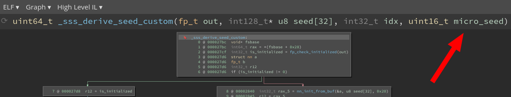
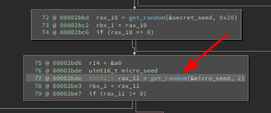
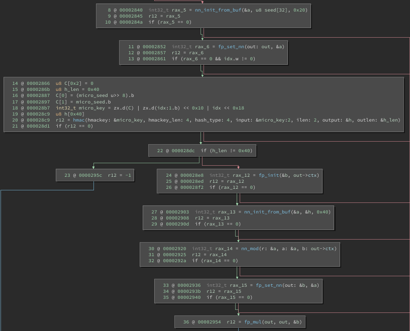

# Share It

*This write-up is for the "Share It" challenge of [FCSC 2022](https://france-cybersecurity-challenge.fr). Two files are given: a binary and an output.*

Scrooge McDuck made a good decision by choosing a an encryption software developed by the ANSSI. But greed is the root of all evil... By trying to optimize the code, he actually introduced a mortal flaw, that we are going to exploit.

## Understanding the Code

The original source code can be found on [GitHub](https://github.com/ANSSI-FR/libecc). The part of interrest is located in `src/examples/sss`. It is an implementation of [Shamir's Secret Sharing](https://en.wikipedia.org/wiki/Shamir%27s_Secret_Sharing), an algorithm that can be used to share a secret among `n` people, in such a way that only a concertation of at least `k` people can recover the secret (with `k` < `n` obviously).

It is advised for the reader to understand the basics of the SSS scheme. TL;DR: a polynomial of degree `k-1` is generated, and every participant is given a point of the curve. If `k` people decide to rebuild the secret, they can reconstruct the polynomial by using a Laplace interpolation.

The main function of interest is `_sss_raw_generate()`. 

```c
/* Import our prime number and create the Fp context */
ret = nn_init_from_buf(&p, prime, sizeof(prime)); EG(ret, err);
ret = fp_ctx_init_from_p(&ctx, &p); EG(ret, err);
```

The code makes heavy use of the `libecc` library. `nn_*` primitives are for manipulating large natural numbers, and `fp_*` primitives are for finite fields (natural numbers modulo a number *p*). We can find that *p* number, which is a large prime, at the top of the source code:

```c
static const u8 prime[] = {
        0xff, 0xff, 0xff, 0xff, 0xff, 0xff, 0xff, 0xff,
        0xff, 0xff, 0xff, 0xff, 0xff, 0xff, 0xff, 0xff,
        0xff, 0xff, 0xff, 0xff, 0xff, 0xff, 0xff, 0xff,
        0xff, 0xff, 0xff, 0xfe, 0xff, 0xff, 0xfc, 0x2f,
};
```

Back to  `_sss_raw_generate()`. 

```c
ret = get_random(secret_seed, sizeof(secret_seed)); EG(ret, err);
```

A `secret_seed` of size 32 is generated.

```c
/* a0 is either derived from the secret seed or taken from input if
 * provided.
 */
ret = fp_init(&a0, &ctx); EG(ret, err);
if(input_secret == SSS_TRUE){
	/* Import the secret the user provides
		 * XXX: NOTE: the user shared secret MUST be in Fp! Since our prime is < (2**256 - 1),
		 * some 256 bit strings can be rejected here (namely those >= p and <= (2**256 - 1)).
	*/
	ret = fp_import_from_buf(&a0, secret->secret, SSS_SECRET_SIZE); EG(ret, err);
}
else{
		/* Generate the secret from our seed */
	ret = _sss_derive_seed(&a0, secret_seed, 0); EG(ret, err);
}
```

The Shamir secret is `a0`, the coefficient of degree 0. It is either generated at random, or specified by the user.

```c
idx_shift = 0;
while(idx_shift == 0){
	ret = get_random((u8*)&idx_shift, sizeof(idx_shift)); EG(ret, err);
}
```

Every participant is given a coefficient at a given index. To avoid leaking the total number of shares, the indexes do not start at 0 but at a random value `idx_shift`.

```c
num_shares = 0;
i = 0;
while(num_shares < n){
	_sss_raw_share *cur_share_i = &(shares[num_shares].raw_share);
	u16 curr_idx = (u16)(idx_shift + i);
	if(curr_idx == 0){
		/* Skip the index 0 specific case */
		i++;
		continue;
	}
	/* Set s[i] to the a[0] as blinded initial value */
	ret = fp_mul(&s, &blind, &a0); EG(ret, err);
	/* Get a random base x as u16 for share index */
	ret = fp_set_word_value(&base, (word_t)curr_idx); EG(ret, err);
	/* Set the exp to 1 */
	ret = fp_one(&exp); EG(ret, err);
	for(j = 1; j < k; j++){
		/* Compute x**j by iterative multiplications */
		ret = fp_mul_monty(&exp, &exp, &base); EG(ret, err);
		/* Compute our a[j] coefficient */
		ret = _sss_derive_seed(&a, secret_seed, (u16)j); EG(ret, err);
		/* Blind a[j] */
		ret = fp_mul_monty(&a, &a, &blind); EG(ret, err);
		/* NOTE1: actually, the real a[j] coefficients are _sss_derive_seed(secret_seed, j)
		 * multiplied by some power of r^-1 (the Montgomery constant), but this is OK as
		 * we need any random values (computable from the secret seed) here. We use this "trick"
		 * to be able to use our more performant redcified versions of Fp multiplication.
		 *
		 * NOTE2: this trick makes also this generation not deterministic with the same seed
		 * on binaries with different WORD sizes (16, 32, 64 bits) as the r Montgomery constant will
		 * differ depending on this size. However, this is not really an issue per se for our SSS
		 * as we are in our generation primitive and the a[j] coefficients are expected to be
		 * random (the only drawback is that deterministic test vectors will not be consistent
		 * across WORD sizes).
		 */
		/* Accumulate */
		ret = fp_mul_monty(&tmp, &exp, &a); EG(ret, err);
		ret = fp_add(&s, &s, &tmp); EG(ret, err);
	}
	/* Export the computed share */
	PUT_UINT16_BE(curr_idx, (u8*)&(cur_share_i->index), 0);
	/* Unblind */
	ret = fp_mul(&s, &s, &blind_inv); EG(ret, err);
	ret = fp_export_to_buf(cur_share_i->share, SSS_SECRET_SIZE, &s); EG(ret, err);
	num_shares++;
	i++;
}
```

Ok, that's a big chunk of code. For every share, the polynom is evaluated at a specific index value of `x`. The coefficients are generated on-the-fly. Every share is exported as an (index ; value) pair.

```c
/* The secret is a[0] */
ret = fp_export_to_buf(secret->secret, SSS_SECRET_SIZE, &a0);
```

Finally the secret is exported.

There is something important to notice about how RNG is performed: everything is derived from `secret_seed` using the function `_sss_derive_seed()`.

```c
ATTRIBUTE_WARN_UNUSED_RET static int _sss_derive_seed(fp_t out, const u8 seed[SSS_SECRET_SIZE], u16 idx)
{
	int ret;
	u8 hmac_val[SHA512_DIGEST_SIZE];
	u8 C[2];
	u8 len;
	nn nn_val;

	/* Sanity check on sizes to avoid entropy loss through reduction biases */
	MUST_HAVE((SHA512_DIGEST_SIZE >= (2 * SSS_SECRET_SIZE)), ret, err);

	/* out must be initialized with a context */
	ret = fp_check_initialized(out); EG(ret, err);

	ret = local_memset(hmac_val, 0, sizeof(hmac_val)); EG(ret, err);
	ret = local_memset(C, 0, sizeof(C)); EG(ret, err);

	/* Export our idx in big endian representation on two bytes */
	PUT_UINT16_BE(idx, C, 0);

	len = sizeof(hmac_val);
	ret = hmac(seed, SSS_SECRET_SIZE, SHA512, C, sizeof(C), hmac_val, &len); EG(ret, err);

	ret = nn_init_from_buf(&nn_val, hmac_val, len); EG(ret, err);
	/* Since we will put this in Fp, take the modulo */
	ret = nn_mod(&nn_val, &nn_val, &(out->ctx->p)); EG(ret, err);
	/* Now import our reduced value in Fp as the result of the derivation */
	ret = fp_set_nn(out, &nn_val);

err:
	/* Cleanup secret data */
	IGNORE_RET_VAL(local_memset(hmac_val, 0, sizeof(hmac_val)));
	IGNORE_RET_VAL(local_memset(C, 0, sizeof(C)));
	nn_uninit(&nn_val);

	return ret;
}

```

This function binds the secret seed to an index value using a secure HMAC-SHA512. Everything is still performed in our finite field, so the result is returned modulo *p*.

## What is Wrong?

The next step is to understand what is different between our binary and the original source code.

After opening our favorite reverse engineering software, we find that `_sss_derive_seed()` has an additional parameter:



We decide to call it `micro_seed`, because it is small and generated randomly in `_sss_raw_generate`.



So, what is the purpose of this parameter? This is the body of `_sss_derive_seed()`:



Let's break it down:
* A temporary variable `a` is created as a number in our finite field.
* `a` is initialized to the secret seed.
* The content of `a` is put into the output parameter.
* A HMAC-SHA512 is computing using the concatenation `index || micro_seed` as a key, and the value of `index` as input message. The numbers are encoded as big-endian before being fed to HMAC.
* `a` is set to the output of the HMAC.
* `a` is computed modulo *p*.
* `a` is put into `b`.
* The output parameter is multipled by `b`.

To sum it up: `output = secret_seed * hmac(key = index+micro_seed, message = index)`.

All of a suden, this `_sss_derive_seed()` does not seem very strong...

## Breaking the Code

What if we knew this `micro_seed` value? Well, every coefficient of the polynomial is derived from it, plus the secret seed.

```c
/* Compute our a[j] coefficient */
ret = _sss_derive_seed(&a, secret_seed, (u16)j); EG(ret, err);
```

As we have one share at our disposition, we could solve the equation `share = secret_seed * hmac(key = known_value, message = known_value)`.

Time for brute-force!

Actually, there are two unknown parameters: the micro seed and the parameter `k`, which has an influence on the computed secret.

First, we are going to patch the orignal code to match the modified one. Then, we will modify it for the purpose of the exhaustive search.

```c
ATTRIBUTE_WARN_UNUSED_RET static int _sss_derive_seed_custom(fp_t out, const u8 seed[SSS_SECRET_SIZE], u16 idx, u16 micro_seed)
{
	int ret;
	u8 hmac_val[SHA512_DIGEST_SIZE];
	u8 C[2];
	u8 len;
	nn nn_val;

	/* Sanity check on sizes to avoid entropy loss through reduction biases */
	MUST_HAVE((SHA512_DIGEST_SIZE >= (2 * SSS_SECRET_SIZE)), ret, err);

	/* out must be initialized with a context */
	ret = fp_check_initialized(out); EG(ret, err);

	ret = local_memset(hmac_val, 0, sizeof(hmac_val)); EG(ret, err);
	ret = local_memset(C, 0, sizeof(C)); EG(ret, err);

	nn tmp;
	fp tmp2;

	ret = nn_init_from_buf(&tmp, seed, SSS_SECRET_SIZE);
	EG(ret, err);
	ret = fp_set_nn(out, &tmp);
	EG(ret, err);

	if (idx != 0)
	{

		/* Export our idx in big endian representation on two bytes */
		PUT_UINT16_BE(idx, C, 0);

		u8 key[4];
		PUT_UINT16_BE(micro_seed, key, 0);
		memcpy(key + 2, C, sizeof(C));

		len = sizeof(hmac_val);
		ret = hmac(key, sizeof(key), SHA512, C, sizeof(C), hmac_val, &len);
		EG(ret, err);

		ret = fp_init(&tmp2, out->ctx);
		EG(ret, err);
		ret = nn_init_from_buf(&tmp, hmac_val, len);
		EG(ret, err);
		ret = nn_mod(&tmp, &tmp, &out->ctx->p);
		EG(ret, err);
		ret = fp_set_nn(&tmp2, &tmp);
		EG(ret, err);
		ret = fp_mul(out, out, &tmp2);
		EG(ret, err);
	}

err:
	/* Cleanup secret data */
	IGNORE_RET_VAL(local_memset(hmac_val, 0, sizeof(hmac_val)));
	IGNORE_RET_VAL(local_memset(C, 0, sizeof(C)));
	fp_uninit(&tmp2);
	nn_uninit(&tmp);
	nn_uninit(&nn_val);

	return ret;
}
```

This implementation of `_sss_derive_seed()` matches what we have found in the binary.

Now, in `_sss_raw_generate()`:

```c
/***** Raw versions ***********************/
/* SSS shares and secret generation */
ATTRIBUTE_WARN_UNUSED_RET static int _sss_raw_generate(sss_share *shares, u16 k, u16 n, sss_secret *secret, boolean input_secret, u16 micro_seed)
{
```

We add a `micro_seed` parameter, because we want to brute-force it, not generate it randomly.

```c
//ret = get_random(secret_seed, sizeof(secret_seed)); EG(ret, err);
secret_seed[SSS_SECRET_SIZE - 1] = 1;
ret = fp_import_from_buf(&a0, secret_seed, SSS_SECRET_SIZE); EG(ret, err);
ret = fp_export_to_buf(secret_seed, SSS_SECRET_SIZE, &a0); EG(ret, err);
ret = _sss_derive_seed_custom(&a0, secret_seed, 0, micro_seed); EG(ret, err);
```

We do not want to generate a random secret seed. Rather, replacing it by the value 1 will make it easier for solving the final equation.

Please note that `a0 == secret_seed` when we use the custom `_sss_derive_seed()`.

```c
idx_shift = 0;
while(idx_shift == 0){
	//get_random((u8*)&idx_shift, sizeof(idx_shift)); EG(ret, err);
	idx_shift = 25314;
}
```

We don't want a random index shift either. It is fixed to 25314, so that the first index computed will match the given share.

```c
num_shares = 0;
i = 0;
//while(num_shares < n){
while(num_shares < 1){
```

All we need is to compute the first coefficient. We can limit the number of iterations to 1.

At this point, the `_sss_raw_generate()` function has been turned into a function that computes the HMAC value used in `_sss_derive_seed()`.

```c
int main()
{
	sss_share share;
	sss_secret secret;

	char print_buf[SSS_SECRET_SIZE * 2 + 1];

	for (int micro_seed = 0; micro_seed < 65536; ++micro_seed)
	{
		for (int k = 2; k < 60; ++k)
		{
			if (_sss_raw_generate(&share, k, 70, &secret, SSS_FALSE, micro_seed) != 0)
				errx(1, "fail");

			memset(print_buf, 0, sizeof(print_buf));
			for (size_t i = 0; i < SSS_SECRET_SIZE; ++i) {
				sprintf(print_buf + 2 * i, "%02x", share.raw_share.share[i]);
			}

			printf("%s ; micro_seed = %d ; k = %d\n", print_buf, micro_seed, k);
		}
	}
}
```

Finally, this `main()` function iterates over all possible values of `micro_seed` and `k`. For every combination, the output of our custom `_sss_raw_generate()` is printed in hexadecimal form.

## Decryption

Let's switch back to python for the final steps.

```python
P = int.from_bytes([
    0xff, 0xff, 0xff, 0xff, 0xff, 0xff, 0xff, 0xff,
    0xff, 0xff, 0xff, 0xff, 0xff, 0xff, 0xff, 0xff,
    0xff, 0xff, 0xff, 0xff, 0xff, 0xff, 0xff, 0xff,
    0xff, 0xff, 0xff, 0xfe, 0xff, 0xff, 0xfc, 0x2f,
], "big", signed=False)
```

This prime number is taken from the C source code.

```python
def decode_share(binary):
    index, share, session_id, raw_share_hmac = struct.unpack(">H32s16s32s", binary)
    return {
        "index": index,
        "share": share,
        "session_id": session_id,
        "raw_share_hmac": raw_share_hmac
    }
```

This function decodes a binary share into a dictionary.

```python
def check_share(share: bytes, secret: int):
    h = hmac.digest(secret.to_bytes(32, "big", signed=False), share[:50], "sha256")
    return h == share[50:]
```

The shares are authenticated using HMAC. We use this for the `check_share()` function, which will enable us to test values of the secret seed.

```python
def igcd(a, b):
	# Stolen from https://codes-sources.commentcamarche.net/source/view/102305/1482024#browser
    # Initialisation
    d, u, v, d1, u1, v1 = a, 1, 0, b, 0, 1
    # Calcul
    while d1 != 0:
        q = d // d1
        d, u, v, d1, u1, v1 = d1, u1, v1, d - q * d1, u - q * u1, v - q * v1
    return (d, u, v)


def modular_div(product: int, factor_a: int, n: int) -> int:
    gcd, s, t = _igcd(factor_a, n)
    assert gcd == 1
    assert s * factor_a + t * n == gcd

    factor_b = (product * s) % n

    assert (factor_a * factor_b) % n == product
    return factor_b


with open("./share_0.bin", "rb") as f:
    share_bytes = f.read()
    share = decode_share(share_bytes)
    print(share)


y = int.from_bytes(share["share"], "big", signed=False)

total_lines = 65536 * 60
line_count = 0

while True:
    line = sys.stdin.readline()
    factor = line.split(";")[0]
    factor = int(factor, 16)

    seed = arithmetic.modular_div(y, factor, P)
    if check_share(share_bytes, seed):
        print(seed)

    line_count += 1
    if line_count % 10000 == 0:
        print(f"{int(line_count/total_lines*100)}%")
```

Putting it all together:
* We decode the given share file.
* We read all the outputs of the modified program in a loop.
* Every line contains a candidate value for the HMAC. Because `share == secret_seed * HMAC_VALUE % P` , it is possible to find the secret seed using the extended Euclidean algorithm, implemented in `modular_div()` and `igcd()`.

Now is the decisive moment:

```
$ ./patched-sss | python3 ./chal_share_it.py
{'index': 25314, 'share': b"\xb8\x9a(^U\x05\xb7\x93\x96\x9e#\\\x01f2yp)\xe7\xc4\xbf\x17y\x17e\xce\xfc\xe7:'E\r", 'session_id': b'P@jtF\x9f\x9cX\xa0\xe1M7\xf0&,\x95', 'raw_share_hmac': b'\xec\xf9\x8aTJf\x8e\xb3\x90%\xba\xe3B\xc2W1\xa0\xfd4\xbd\x13\x04\xe8\xfc\x92\x04\xcc\xb8z\xd0\xbco'}
0%
0%
0%
1%
1%
		[...]
9%
10%
10%
31780852818406902965235074623624531771111589944945000161228877536360691413117
10%
10%
11%
		[...]
```

We recovered the seed!

In a python interpreter:

```python
>>> seed = 31780852818406902965235074623624531771111589944945000161228877536360691413117
>>> seed.to_bytes(32, "big")
b'FCSC{48.8522620000/2.2865220000}'
```

This looks a lot like a flag...
